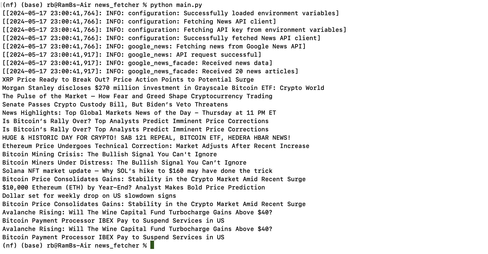

# news_fetcher
# News Fetcher

News Fetcher is a Python package that fetches news articles from various sources using the NewsAPI(https://newsapi.org/). The package can be used to fetch news based on keywords, sources, domains, and other parameters. It also includes a Flask-based web interface to display the fetched news articles.

## Project Structure
```plaintext
news_fetcher/
│
├── src/
│   ├── news_fetcher/
│   │   ├── __init__.py
│   │   ├── components/
│   │   │   ├── __init__.py
│   │   │   └── google_news.py
│   │   ├── config/
│   │   │   ├── __init__.py
│   │   │   └── configuration.py
│   │   ├── entity/
│   │   │   ├── __init__.py
│   │   │   └── config_entity.py
│   │   ├── facade/
│   │   │   ├── __init__.py
│   │   │   └── news_facade.py
│   │   ├── utils/
│   │   │   ├── __init__.py
│   │   │   └── common.py
│   │   └── logging_config.py
│   └── tests/
│       ├── __init__.py
│       ├── test_configuration.py
│       ├── test_google_news.py
│       └── test_news_facade.py
├── templates/
│   └── index.html
├── .env
├── app.py
├── README.md
├── LICENSE
├── requirements.txt
├── run_tests.py
└── setup.py
└── template.py

```

## Installation

1. Clone the repository:

```
git clone https://github.com/rrrreddy/news_fetcher.git
```

```
cd news_fetcher
```

2. Create a virtual environment:
```
python -m venv nf
source nf/bin/activate  # On Windows use `nf\Scripts\activate`
```

3. Install the dependencies:

```
pip install -r requirements.txt
```
4. Set up environment variables:

Create a .env file in the root directory of the project and add your NewsAPI key:

```
NEWS_API_KEY=your_news_api_key
```

## Usage

### Running the Flask Application

You can use it as a package or you can use it as an app by Running the Flask Application

1. Run the Flask application:

```
python app.py
```

2. Open your browser and navigate to http://127.0.0.1:5000/ to see the web interface.


### Fetching News Programmatically

You can also use the package programmatically:

```
from news_fetcher.facade.google_news_facade import get_news

# Fetch news articles
news_data = get_news(keywords='bitcoin', language='en', sort_by='publishedAt')

for article in news_data:
    print(article.title)

```


## Project Components

* components/google_news.py: Contains the function to fetch news from the NewsAPI.
* config/configuration.py: Configuration and setup for the NewsAPI client.
* entity/config_entity.py: Data class for representing a news article.
* facade/news_facade.py: Facade for fetching and processing news articles.
* utils/common.py: Utility functions.
* app.py: Flask application to display news articles.
* templates/index.html: HTML template for the Flask web interface.
* tests: Contains test cases for the project.

## License

This project is licensed under the MIT License - see the `LICENSE` file for details.


```

This `README.md` file provides an overview of your project, including the structure, installation instructions, usage examples, and a brief description of each component. Feel free to customize it further based on your specific requirements and project details.
```

